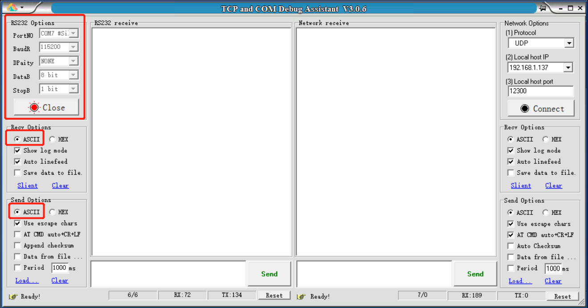
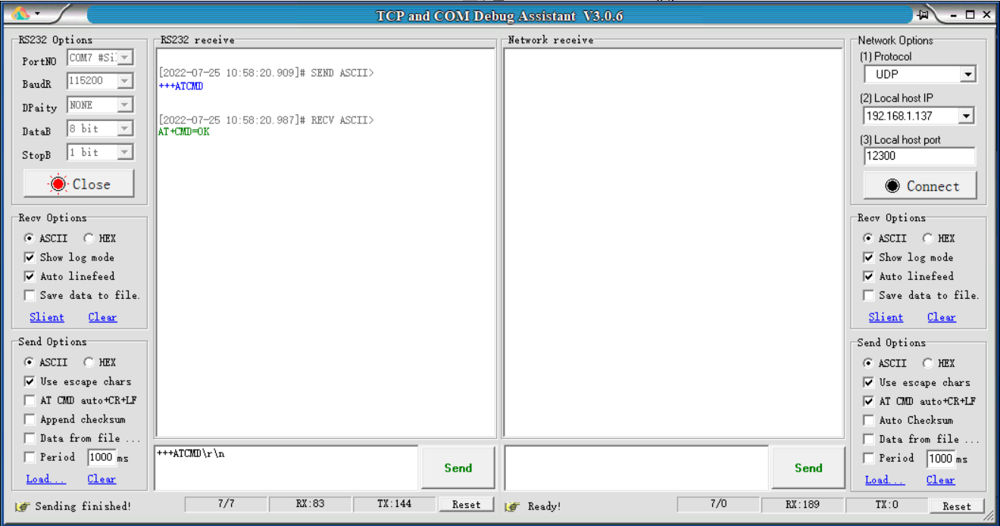
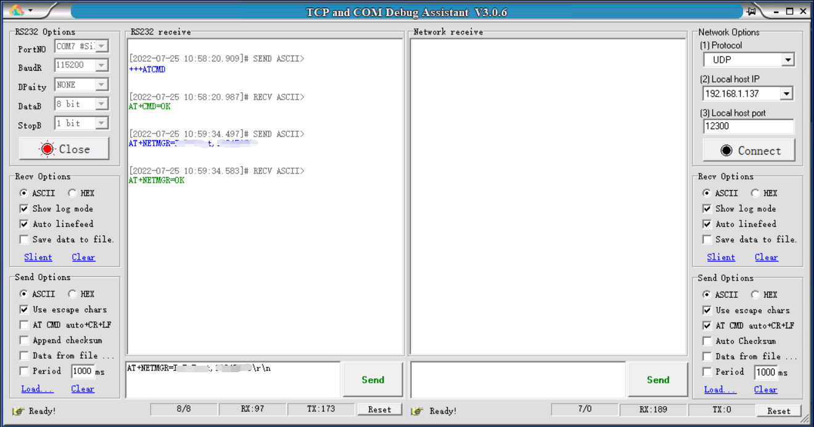
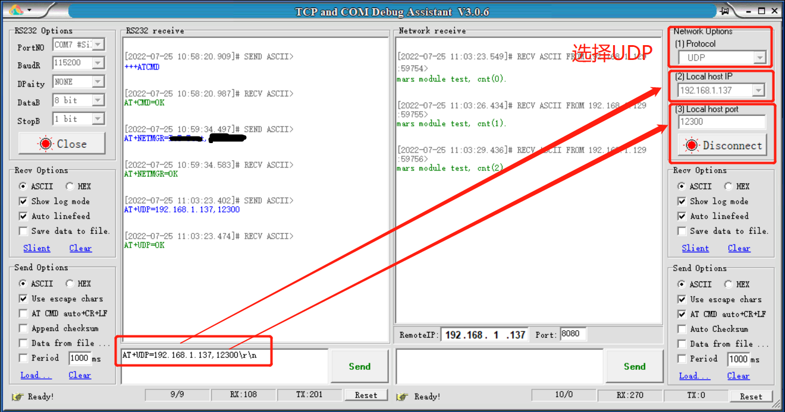
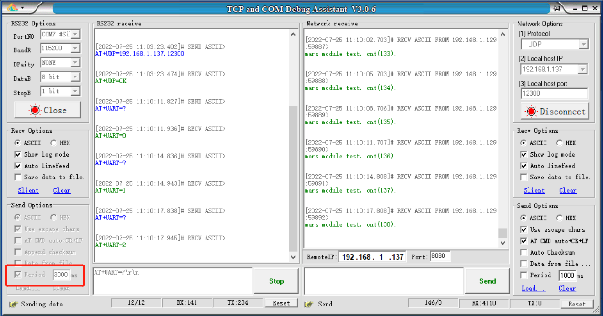

# TG7100C老化测试方案


# 老化测试流程


# AT指令

* 进入AT指令模式

  ```
  设置：+++ATCMD\r\n						应答：AT+CMD=OK\r\n
  ```

* 网络配置指令

  ```
  设置：AT+NETMGR=ssid,password\r\n		应答：AT+NETMGR=OK\r\n
  ```

* UDP配置指令

  ```
  设置：AT+UDP=ip,port\r\n				应答：AT+UDP=OK\r\n
  ```

* 串口测试

  ```
  查询：AT+UART=?\r\n					应答：AT+UART=cnt\r\n(cnt从0-254循环)
  ```

  

# 操作示范

1. 打开TCPCOM软件，配置好串口



2. 发送指令进入AT指令模式（+++ATCMD\r\n）



3. 发送指令配置WIFI（AT+NETMGR=wifi名称，密码\r\n）



4. 配置UDP信息（AT+UDP=电脑IP,12300\r\n）

   注：测试模组需要和电脑在同一局域网下，IP选择电脑IP，port任意。右侧窗口会每隔3S打印一条信息



5. 配置串口测试命令（AT+UART=?\r\n），配置循环发送，即可测试串口



